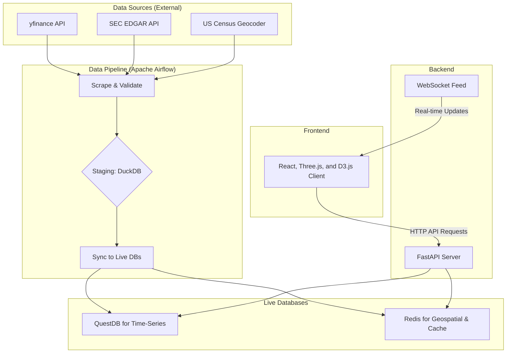

# Voila: A Geospatial Market Data Platform

Voila is a full-stack application that visualizes U.S. stock market data (NASDAQ) on an interactive 3D map. It provides a geospatial perspective on market trends, allowing users to select, analyze, and view real-time data for publicly traded companies based on their headquarters' locations.

## System Architecture

The application is designed with a data ingestion pipeline, a backend serving layer, and a frontend rendering client.

### Core Components

*   **Data Pipeline (Apache Airflow):** Orchestrates a daily batch job that scrapes market data (yfinance), company information (EDGAR), and geocodes addresses (US Census). It uses **DuckDB** as a staging layer for data transformation and validation before syncing to production databases.

*   **Backend API (FastAPI):** A high-performance, asynchronous API built in Python, managed by uv. It serves both historical time-series data and real-time geospatial queries. It connects to QuestDB for fast time-series analysis and Redis for low-latency geospatial lookups and API response caching. A WebSocket endpoint provides a real-time feed of market updates to connected clients.

*   **Frontend (React & Three.js):** A dynamic, single-page application built with React, Three.js, and D3.js in TypeScript for rendering the 3D map visualization. It offloads heavy spatial calculations to a **Web Worker** to maintain a fluid UI and uses a **Service Worker** for offline-first caching of assets and API data. State management is handled by **Redux Toolkit** and **TanStack Query**.

*   **Databases:**
    *   **QuestDB:** The primary time-series database for storing all OHLCV (Open, High, Low, Close, Volume) market data. Chosen for its high-speed ingestion via the InfluxDB Line Protocol and fast analytical queries.
    *   **Redis:** Serves two purposes: a geospatial index (using `GEOADD`) for fast "nearby companies" queries and a general-purpose cache for expensive API responses.
    *   **DuckDB:** Acts as a local data warehouse for the staging and transformation of raw data within the Airflow pipeline. It is not used by the live API.

### Data Flow

1.  **Ingestion:** An Airflow DAG runs daily, triggering Python scripts to scrape data from external APIs.
2.  **Staging & Transformation:** Raw data is loaded into a local DuckDB database. SQL transformations are run to clean, validate, and join the datasets.
3.  **Synchronization:** A final pipeline task pushes the transformed data from DuckDB into the live systems: OHLCV data is sent to QuestDB, and company location data is indexed in Redis.
4.  **Serving:** The user loads the React application, which fetches initial company and market data from the FastAPI backend.
5.  **Interaction:** The user interacts with the 3D map, triggering API calls for historical charts or new geospatial queries.
6.  **Real-time Updates:** A WebSocket connection pushes live price changes to the frontend, which updates the visualization and UI components in real-time.
